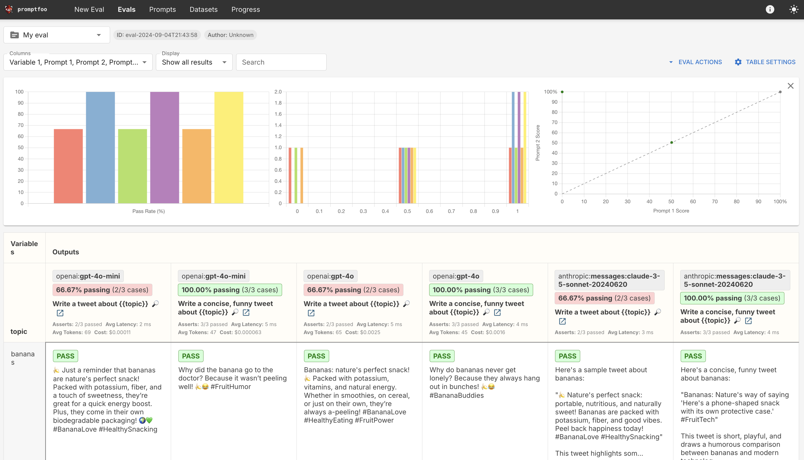

# promptfoo

See [Getting Started](https://www.promptfoo.dev/docs/getting-started/)

Jumpstart:

After installing promptfoo with `brew install promptfoo` or `npm install -g promptfoo`

- make a promptfoo project directory

- in the project directory create a .env file similar to dotenv.txt

- follow bash conventions, no spaces, no quotes, no comments

- `source ./load_dotenv.sh` to export all the API keys. Could just have made a 'hidden' bash script but this puts the keys in a 'hidden' .env file, usable by python-dotenv, with the bash script to set them up as a normal file in GitHub. Must use `source`, if you just say `./load_dotenv.sh` it will create a child process and not export environment variables back to the parent process.

- Then you can make a directory for your project and `cd` into it.

- `promptfoo init` will create `promptfooconfig.yaml` file in your current directory.

- To see some evals `cd getting_started` ; `promptfoo eval` will run evals

- `promptfoo view` will run an interactive browser session that lets you run evals, edit prompts and evals, and view results. It should store all the evals and hopefully let you see how they improve over time.

